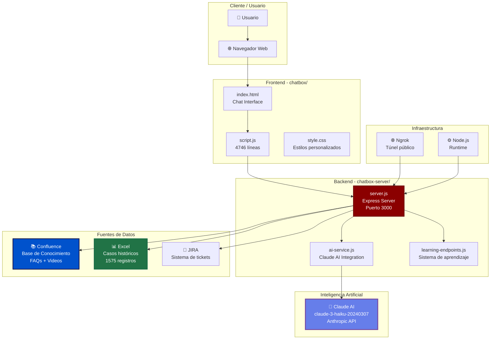
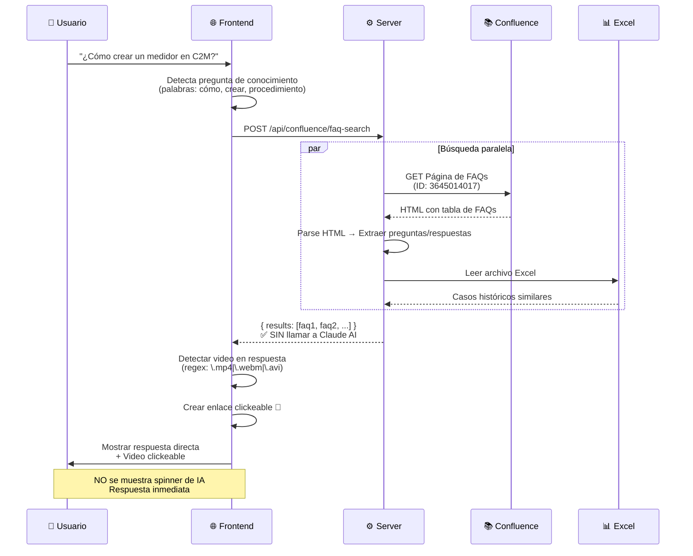
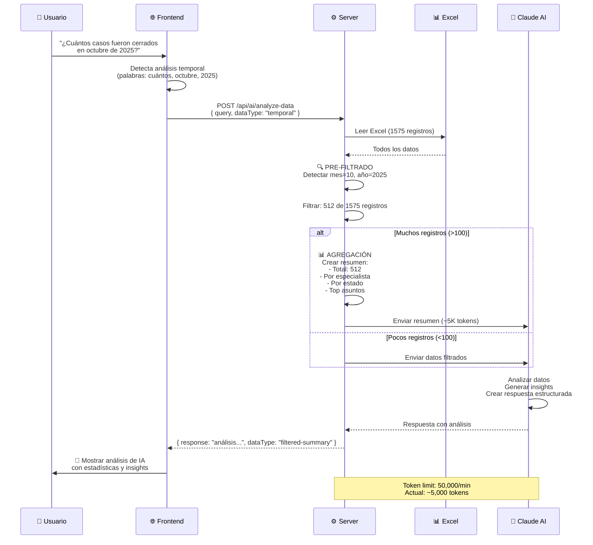
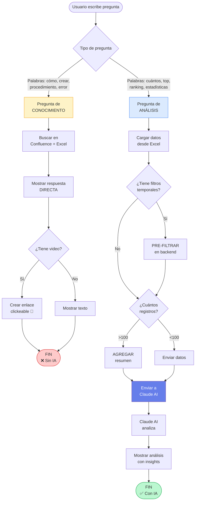

# 🏗️ Arquitectura del AI-Assisted Support Agent

## 📊 Diagrama de Arquitectura General



---

## 🔄 Flujo de Datos - Pregunta de Conocimiento (SIN IA)



**Resultado:** 
- ✅ Respuesta directa de Confluence/Excel
- ✅ Video clickeable si existe
- ❌ NO usa Claude AI
- ⚡ Muy rápido (< 1 segundo)

---

## 📈 Flujo de Datos - Análisis de Datos (CON IA)



**Resultado:**
- ✅ Pre-filtrado en backend (512 de 1575)
- ✅ Agregación si >100 registros
- ✅ Envío eficiente a Claude AI
- ✅ Respuesta con estadísticas e insights
- ⏱️ ~3-5 segundos

---

## 🧠 Decisión: ¿Cuándo usar IA?



---

## 🎯 Componentes del Sistema

### 1. **Frontend (chatbox/script.js)**

```javascript
// 4746 líneas de código
// Responsabilidades:

├── Interfaz de usuario (chat)
├── Detección de tipo de pregunta
│   ├── Conocimiento: cómo, crear, error
│   └── Análisis: cuántos, top, ranking
├── Renderizado de respuestas
│   ├── FAQs de Confluence
│   ├── Videos clickeables 🎥
│   └── Análisis de IA
├── Gestión de estado
│   └── reportState, smartTicketState
└── Comunicación con backend
    └── fetch() a endpoints REST
```

**Funciones clave:**
- `searchInFAQs()` - Busca en Confluence/Excel (línea 821)
- `handleAnalyticalQueryWithAI()` - Análisis con IA (línea 2534)
- `detectVideoInResponse()` - Enlaces de video (línea 906)

---

### 2. **Backend (chatbox-server/server.js)**

```javascript
// 1358 líneas de código
// Responsabilidades:

├── Servidor Express (puerto 3000)
├── Endpoints REST
│   ├── /api/confluence/faq-search
│   ├── /api/ai/analyze-data
│   ├── /api/jira/create-ticket
│   └── /api/data/analyze
├── Pre-filtrado de datos
│   └── Detecta mes/año en query
├── Conversión de fechas
│   ├── Excel serial → DD/MM/YYYY
│   └── Text dates → Normalized
└── Integración con servicios
    ├── Confluence API
    ├── JIRA API
    ├── Excel (xlsx)
    └── Claude AI (ai-service.js)
```

**Funciones clave:**
- `excelSerialToDate()` - Convierte fechas Excel (línea 48)
- `normalizeDateString()` - Normaliza formato (línea 70)
- Pre-filtrado temporal (línea 1206-1330)

---

### 3. **Servicio de IA (ai-service.js)**

```javascript
// Responsabilidades:

├── Cliente de Anthropic
│   └── claude-3-haiku-20240307
├── Generación de prompts dinámicos
│   ├── aggregated (400 palabras)
│   ├── filtered-summary (150 palabras)
│   ├── temporal/analyst (150 palabras)
│   └── excel/general (400 palabras)
├── Gestión de tokens
│   └── Límite: 50,000 tokens/min
└── Manejo de errores
    └── Rate limiting, timeouts
```

**Prompt por tipo de datos:**

| Tipo | Palabras | Instrucciones |
|------|----------|---------------|
| `filtered-summary` | 150 | "Datos ya filtrados, mostrar conteo y resumen" |
| `temporal` | 150 | "NO listes casos, solo total y periodo" |
| `aggregated` | 400 | "Datos pre-agregados, top 3-5 con %" |
| `general` | 400 | "Análisis completo con tendencias" |

---

## 📦 Fuentes de Datos

### 1. **Confluence**

```yaml
Base URL: https://redclay.atlassian.net/wiki
Autenticación: Basic Auth (email + token)

Endpoints usados:
  - GET /rest/api/content/{pageId}
    → Obtener página de FAQs (ID: 3645014017)
  
Contenido:
  - Tabla HTML con columnas:
    • Pregunta
    • Aplicación (C2M, FIELD, SALES, SERVICE)
    • Respuesta (puede incluir videos .mp4)
  
Procesamiento:
  1. Parsear HTML → Extraer <tr> y <td>
  2. Decodificar entidades HTML (&aacute; → á)
  3. Buscar coincidencias por palabra clave
  4. Ordenar por relevancia (matchScore)
  5. Detectar videos en respuesta
  6. Generar URL de attachment si hay video
```

**Formato de URL de video:**
```
https://redclay.atlassian.net/wiki/download/attachments/{pageId}/{filename.mp4}
```

---

### 2. **Excel**

```yaml
Archivo: "Reporte Diario OaaS Celsia 20251126.xlsx"
Ubicación: chatbox-server/data/
Pestaña: "Analisis casos"

Estructura:
  Total filas: 1575
  Rango fechas: 29/06/2024 - 25/11/2025
  
Columnas:
  - Create Date → Fecha (DD/MM/YYYY)
  - Specialist → Especialista
  - Status Ticket → Estado
  - App → Aplicación
  - Asunto → Descripción

Conversión de fechas:
  1. Excel serial (45472) → excelSerialToDate()
  2. Text "1/10/2025" → normalizeDateString() → "01/10/2025"
  3. Formato final: DD/MM/YYYY

Pre-filtrado ejemplo (octubre 2025):
  Input: 1575 registros
  Filtrado: 512 registros (mes=10, año=2025)
  Agregado: { total: 512, porEspecialista: {...}, porEstado: {...} }
  Tokens enviados: ~5,000 (vs 50,000 sin filtrar)
```

---

### 3. **JIRA**

```yaml
Base URL: https://your-domain.atlassian.net
Proyecto: CD (Celsia Digital)
Autenticación: Basic Auth

Endpoint usado:
  - POST /rest/api/2/issue
    → Crear ticket

Campos personalizados:
  - customfield_10233: Fecha Fin Tarea (YYYY-MM-DD)

Flujo:
  Usuario → Chatbot → Formulario → JIRA API → Ticket creado
```

---

## 🔑 Variables de Entorno

```bash
# .env file

# Anthropic Claude AI
ANTHROPIC_API_KEY=sk-ant-api03-...
MODEL=claude-3-haiku-20240307

# Confluence
CONFLUENCE_BASE=https://redclay.atlassian.net/wiki
CONFLUENCE_EMAIL=your-email@example.com
CONFLUENCE_TOKEN=your-confluence-token

# JIRA
JIRA_BASE=https://your-domain.atlassian.net
JIRA_EMAIL=your-email@example.com
JIRA_TOKEN=your-jira-token

# Email (nodemailer)
EMAIL_SERVICE=gmail
EMAIL_USER=your-email@gmail.com
EMAIL_PASS=your-app-password
SUPPORT_EMAIL=support@example.com

# Server
PORT=3000
```

---

## 📊 Métricas de Performance

### Preguntas de Conocimiento (sin IA)
```
Tiempo promedio: < 1 segundo
Pasos:
  1. Detección de tipo: ~10ms
  2. Búsqueda en Confluence: ~300ms
  3. Búsqueda en Excel: ~200ms
  4. Renderizado: ~100ms
Total: ~610ms

Tokens usados: 0 (no se llama a Claude AI)
Costo: $0.00
```

### Análisis de Datos (con IA)
```
Tiempo promedio: 3-5 segundos
Pasos:
  1. Detección de tipo: ~10ms
  2. Lectura de Excel: ~500ms
  3. Pre-filtrado: ~200ms (1575 → 512 registros)
  4. Agregación: ~100ms (si >100 registros)
  5. Claude AI request: ~2-4 segundos
  6. Renderizado: ~100ms
Total: ~3-5 segundos

Tokens usados: ~5,000 (con pre-filtrado)
Costo: ~$0.004 por query (Haiku: $0.80 / 1M tokens)

Sin pre-filtrado:
  Tokens: ~50,000
  Error: 429 Rate Limit Exceeded
```

---

## 🔐 Seguridad

```yaml
Autenticación:
  - Confluence: Basic Auth (Base64)
  - JIRA: Basic Auth (Base64)
  - Claude AI: API Key (Bearer token)

Límites:
  - Express payload: 10MB
  - Claude AI rate: 50,000 tokens/min
  - CORS: Habilitado para todos los orígenes

Validaciones:
  - Preguntas fuera de alcance (isOutOfScopeQuestion)
  - Validación de formato de fechas
  - Sanitización de HTML (decodificación de entidades)

Logs:
  - Todas las queries registradas en consola
  - Errores de IA capturados y logueados
  - No se exponen API keys en respuestas
```

---

## 🚀 Deployment

### Local
```bash
# 1. Instalar dependencias
npm install

# 2. Configurar .env
cp .env.example .env
# Editar .env con tus credenciales

# 3. Iniciar servidor
node server.js
# Servidor corriendo en http://localhost:3000

# 4. Túnel público (opcional)
ngrok http 3000
# URL pública: https://xxx.ngrok-free.dev
```

### Producción (DigitalOcean)
```yaml
Infraestructura recomendada:
  - Droplet: $18/mes (2GB RAM, 1 vCPU)
  - OS: Ubuntu 22.04 LTS
  - Node.js: v20.x
  - Process Manager: PM2
  - Reverse Proxy: Nginx
  - SSL: Let's Encrypt (Certbot)

Comandos:
  # Instalar PM2
  npm install -g pm2
  
  # Iniciar app
  pm2 start server.js --name chatbot
  
  # Modo cluster (múltiples instancias)
  pm2 start server.js -i max
  
  # Auto-restart en reinicio de servidor
  pm2 startup
  pm2 save
  
  # Logs
  pm2 logs chatbot
```

---

## 📈 Monitoreo

```javascript
// Endpoints de salud
GET /health
→ { ok: true }

GET /api/ai/status
→ { 
    enabled: true, 
    model: "claude-3-haiku-20240307",
    credit: "$5.00 USD"
  }

// Logs importantes
✅ Servidor iniciado: "🚀 Server running on port 3000"
✅ Claude AI: "🤖 Claude AI: ✅ ACTIVADO"
🔍 Pre-filtrado: "✅ Filtrado: 512 de 1575 registros"
📊 Tokens enviados: "📊 Enviando resumen agregado a Claude"
❌ Error: "❌ Error al conectar con Claude AI"
```

---

## 🎨 Personalizaciones

### Tema Visual
```css
Color primario: #8B0000 (Blood Red)
Logo: Red Clay Consulting
Fuente: -apple-system, BlinkMacSystemFont, "Segoe UI"

Componentes:
  - Chat bubbles: Azul (#2563eb) usuario, Gris bot
  - Botones: Rojo (#8B0000)
  - Enlaces: Azul (#0284c7)
  - Videos: Icono 🎥 + subrayado
  - IA: Gradiente morado (#667eea → #764ba2)
```

### Mensajes
```javascript
// Español por defecto
idioma: "es-ES"

// Emojis contextuales
FAQs: 📚, 📋, ✅
Análisis: 📊, 📈, 🤖
Videos: 🎥
Especialistas: 👤
Aplicaciones: 📱
```

---

## 🔄 Estado Actual del Sistema

```yaml
Versión: 1.0 (Febrero 2026)

Funcionalidades activas:
  ✅ Chat interactivo
  ✅ Búsqueda en Confluence (FAQs)
  ✅ Búsqueda en Excel (casos históricos)
  ✅ Videos clickeables en respuestas
  ✅ Análisis de datos con Claude AI
  ✅ Pre-filtrado temporal (mes/año)
  ✅ Agregación para >100 registros
  ✅ Prompts optimizados (150-400 palabras)
  ✅ Creación de tickets en JIRA
  ✅ Sistema de reportes inteligente
  ✅ Conversión de fechas Excel
  ✅ Túnel público con ngrok

Funcionalidades pendientes:
  ⏳ Cache de consultas frecuentes
  ⏳ Rate limiter personalizado
  ⏳ Sistema de aprendizaje (desactivado)
  ⏳ Panel administrativo
  ⏳ Métricas de satisfacción

Métricas de uso:
  - Claude AI: Tier 1 ($5 crédito)
  - Rate limit: 50,000 tokens/min
  - Uso actual: ~5,000 tokens/query
  - Costo por query: ~$0.004
  - Queries/día estimadas: ~1,000
  - Costo mensual: ~$120 (30 días × 1000 queries × $0.004)
```

---

## 🎓 Casos de Uso

### Caso 1: Usuario busca procedimiento
```
Usuario: "¿Cómo crear un medidor en C2M?"
↓
Sistema detecta: Pregunta de conocimiento
↓
Busca en Confluence + Excel
↓
Encuentra FAQ con video: "Crear_Medidor_Configur_Compon.mp4"
↓
Muestra respuesta + video clickeable 🎥
↓
Tiempo: < 1 segundo
Tokens IA: 0
```

### Caso 2: Usuario solicita estadísticas
```
Usuario: "¿Cuántos casos fueron cerrados en octubre de 2025?"
↓
Sistema detecta: Análisis temporal
↓
Lee Excel: 1575 registros
↓
Pre-filtra: mes=10, año=2025 → 512 registros
↓
Agrega resumen: { total: 512, porEspecialista: {...}, ... }
↓
Envía a Claude AI: ~5,000 tokens
↓
Claude AI genera análisis con insights
↓
Muestra resultados + estadísticas
↓
Tiempo: 3-5 segundos
Tokens IA: ~5,000
```

### Caso 3: Usuario reporta error
```
Usuario: "No puedo crear un dispositivo, sale error de permisos"
↓
Sistema busca soluciones similares en:
  - Confluence (artículos)
  - Excel (casos históricos)
↓
Encuentra solución: "Verificar permiso C2M_EXPERIE_CLIENTES"
↓
Muestra solución + opción crear ticket
↓
Usuario elige: Crear ticket
↓
Formulario inteligente (pre-llenado)
↓
Ticket creado en JIRA automáticamente
```

---

## 🛠️ Troubleshooting

### Problema: Claude AI no responde
```bash
# Verificar API key
node -e "require('dotenv').config(); console.log(process.env.ANTHROPIC_API_KEY ? 'OK' : 'MISSING')"

# Verificar estado
curl http://localhost:3000/api/ai/status

# Ver logs
# Buscar: "❌ Error al conectar con Claude AI"
```

### Problema: Fechas incorrectas
```bash
# Verificar conversión
node check-dates.js

# Ver logs
# Buscar: "Primera fecha:", "Última fecha:", "Casos en octubre 2025"
```

### Problema: Rate limit 429
```bash
# Ver logs
# Buscar: "429 Rate Limit Exceeded"

# Solución: Pre-filtrado ya implementado
# Verifica: "✅ Filtrado: 512 de 1575 registros"
```

---

## 📚 Referencias

- [Claude AI Documentation](https://docs.anthropic.com/)
- [Confluence REST API](https://developer.atlassian.com/cloud/confluence/rest/)
- [JIRA REST API](https://developer.atlassian.com/cloud/jira/platform/rest/)
- [Express.js](https://expressjs.com/)
- [Ngrok](https://ngrok.com/docs)
- [Node.js](https://nodejs.org/docs/)

---

## 👥 Equipo

**Desarrollado para:** Red Clay Consulting, Inc.  
**Cliente:** Celsia  
**Modelo de IA:** Claude 3 Haiku (Anthropic)  
**Fecha:** Febrero 2026

---

¿Preguntas? Consulta [TROUBLESHOOTING.md](./TROUBLESHOOTING.md) o [CLAUDE_AI_SETUP.md](./CLAUDE_AI_SETUP.md)
