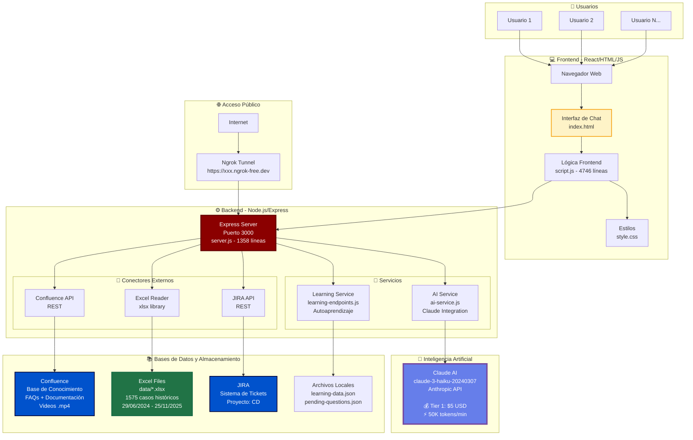
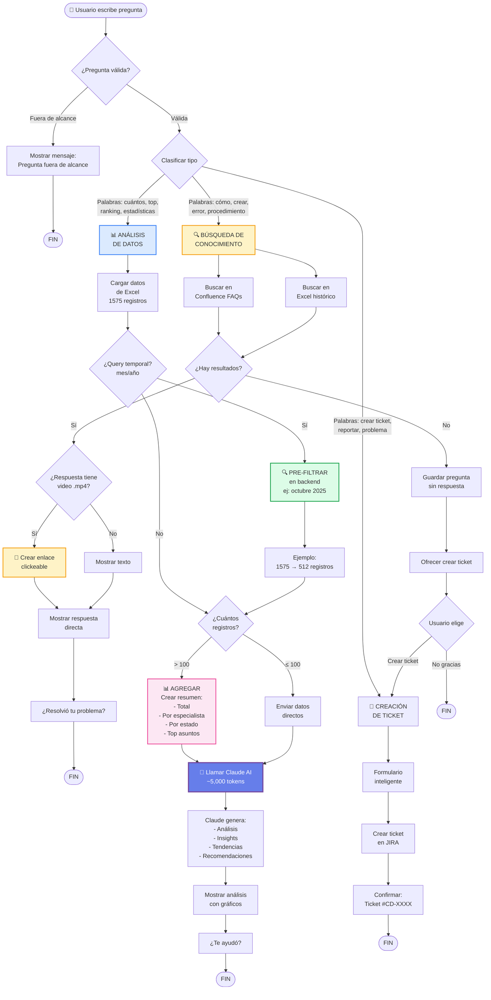
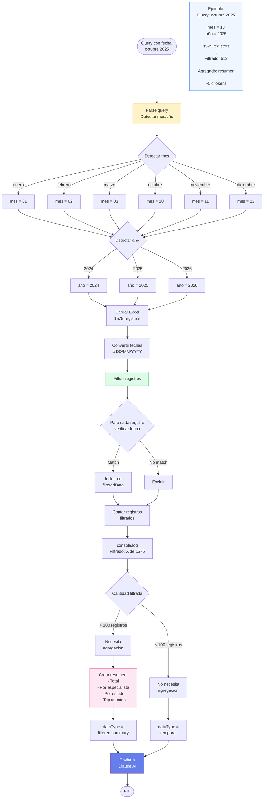
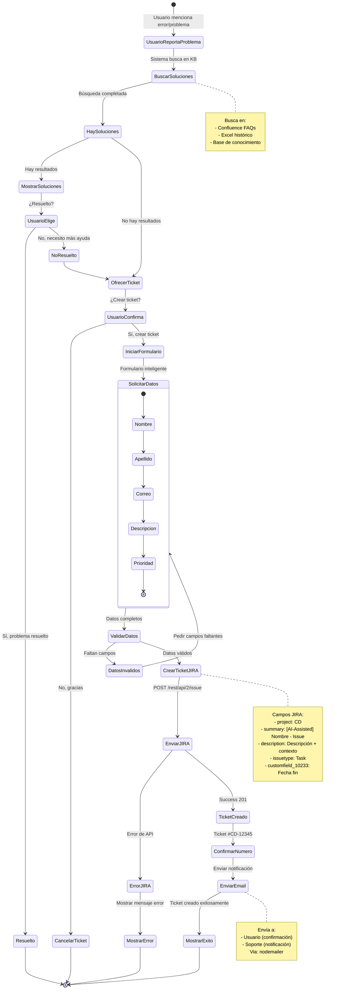

# 🔄 Diagramas de Flujo - AI-Assisted Support Agent

## 📋 Índice de Diagramas

1. [Vista General del Sistema](#1-vista-general-del-sistema)
2. [Flujo Completo: Pregunta de Usuario](#2-flujo-completo-pregunta-de-usuario)
3. [Flujo: Búsqueda de Conocimiento (Sin IA)](#3-flujo-búsqueda-de-conocimiento-sin-ia)
4. [Flujo: Análisis de Datos (Con IA)](#4-flujo-análisis-de-datos-con-ia)
5. [Flujo: Pre-filtrado Temporal](#5-flujo-pre-filtrado-temporal)
6. [Flujo: Creación de Tickets](#6-flujo-creación-de-tickets)
7. [Flujo: Detección de Videos](#7-flujo-detección-de-videos)
8. [Arquitectura de Componentes](#8-arquitectura-de-componentes)

---

## 1. Vista General del Sistema



---

## 2. Flujo Completo: Pregunta de Usuario



---

## 3. Flujo: Búsqueda de Conocimiento (Sin IA)

```mermaid
sequenceDiagram
    autonumber
    participant U as 👤 Usuario
    participant FE as 🌐 Frontend<br/>script.js
    participant BE as ⚙️ Backend<br/>server.js
    participant C as 📚 Confluence
    participant E as 📊 Excel
    
    U->>FE: Escribe: "¿Cómo crear un medidor en C2M?"
    
    Note over FE: Detecta palabras clave:<br/>"cómo", "crear"<br/>→ Pregunta de conocimiento
    
    FE->>FE: isKnowledgeQuery() = true
    FE->>FE: NO llamar a Claude AI
    
    FE->>BE: POST /api/confluence/faq-search<br/>{ q: "crear medidor C2M", sistema: null }
    
    Note over BE: Búsqueda paralela en<br/>Confluence y Excel
    
    par Buscar en Confluence
        BE->>C: GET /rest/api/content/3645014017<br/>(Página de FAQs)
        C-->>BE: HTML con tabla de FAQs<br/>(127KB de contenido)
        Note over BE: Parsear HTML:<br/>1. Extraer <tr> rows<br/>2. Extraer <td> cells<br/>3. Decodificar entidades (&aacute;)<br/>4. Calcular matchScore
    and Buscar en Excel
        BE->>E: Leer archivo .xlsx
        E-->>BE: Casos históricos (1575 registros)
        Note over BE: Filtrar por palabras clave:<br/>"medidor", "crear", "C2M"
    end
    
    BE->>BE: Ordenar resultados por relevancia
    BE->>BE: Limitar a top 5 resultados
    
    BE-->>FE: {<br/>  success: true,<br/>  results: [<br/>    {<br/>      pregunta: "¿Cómo crear medidor?",<br/>      aplicacion: "C2M",<br/>      respuesta: "Crear_Medidor.mp4",<br/>      confluenceUrl: "https://..."<br/>    }<br/>  ]<br/>}
    
    Note over FE: ❌ NO llama a Claude AI<br/>Muestra resultados directos
    
    FE->>FE: Detectar video en respuesta:<br/>regex: /\.(mp4|webm|avi)$/i
    
    alt Respuesta contiene video
        FE->>FE: Extraer nombre archivo:<br/>"Crear_Medidor.mp4"
        FE->>FE: Construir URL:<br/>https://redclay.atlassian.net/wiki/<br/>download/attachments/{pageId}/<br/>Crear_Medidor.mp4
        FE->>U: Mostrar: 🎥 Crear_Medidor.mp4 (clickeable)
    else Solo texto
        FE->>U: Mostrar: ✅ Procedimiento paso a paso...
    end
    
    FE->>U: ¿Esta información te ayudó?<br/>[✅ Sí] [📋 Crear ticket] [❌ No]
    
    U->>FE: Click [✅ Sí]
    FE->>U: ¡Excelente! 😊
    
    Note over U,FE: ⏱️ Tiempo total: < 1 segundo<br/>💰 Tokens Claude AI: 0<br/>💵 Costo: $0.00
```

---

## 4. Flujo: Análisis de Datos (Con IA)

```mermaid
sequenceDiagram
    autonumber
    participant U as 👤 Usuario
    participant FE as 🌐 Frontend<br/>script.js
    participant BE as ⚙️ Backend<br/>server.js
    participant E as 📊 Excel<br/>1575 registros
    participant AI as 🤖 Claude AI<br/>Haiku
    
    U->>FE: Escribe: "¿Cuántos casos cerrados en octubre 2025?"
    
    Note over FE: Detecta palabras clave:<br/>"cuántos", "octubre", "2025"<br/>→ Análisis temporal
    
    FE->>FE: isDataAnalysisQuery() = true
    FE->>FE: hasMonthQuery = true
    
    FE->>U: 🔍 Analizando datos con IA...
    FE->>U: 🤖 (Mostrar spinner animado)
    
    FE->>BE: POST /api/ai/analyze-data<br/>{<br/>  query: "casos cerrados octubre 2025",<br/>  dataType: "temporal"<br/>}
    
    BE->>E: Leer Excel:<br/>Pestaña "Analisis casos"
    E-->>BE: 1575 registros<br/>(29/06/2024 - 25/11/2025)
    
    Note over BE: 🔍 DETECCIÓN AUTOMÁTICA<br/>de filtros temporales
    
    BE->>BE: Detectar mes/año en query:<br/>- "octubre" → mes = 10<br/>- "2025" → año = 2025
    
    BE->>BE: console.log("🔍 Pre-filtrando datos:<br/>Mes=10, Año=2025")
    
    Note over BE: Filtrar datos ANTES<br/>de enviar a Claude AI
    
    BE->>BE: filteredData = data.filter(row => {<br/>  const fecha = row.Fecha; // "01/10/2025"<br/>  const [dia, mes, año] = fecha.split('/');<br/>  return mes === '10' && año === '2025';<br/>})
    
    BE->>BE: console.log("✅ Filtrado:<br/>512 de 1575 registros")
    
    alt Muchos registros (> 100)
        Note over BE: 📊 AGREGACIÓN<br/>Crear resumen para reducir tokens
        
        BE->>BE: Crear resumen agregado:<br/>{<br/>  total: 512,<br/>  periodo: "octubre 2025",<br/>  porEspecialista: {<br/>    "Juan Pérez": 47,<br/>    "María García": 42,<br/>    ...<br/>  },<br/>  porEstado: {<br/>    "Cerrado": 512,<br/>    ...<br/>  },<br/>  topAsuntos: {<br/>    "Error facturación": 89,<br/>    ...<br/>  }<br/>}
        
        BE->>BE: dataType = "filtered-summary"
        BE->>BE: console.log("📊 Enviando resumen<br/>agregado (~5K tokens)")
        
    else Pocos registros (≤ 100)
        BE->>BE: Enviar datos filtrados directos
    end
    
    BE->>AI: POST https://api.anthropic.com/<br/>v1/messages<br/><br/>model: claude-3-haiku-20240307<br/>max_tokens: 1500<br/>temperature: 0.3<br/><br/>system: "Eres un analista experto..."<br/>messages: [{<br/>  role: "user",<br/>  content: "Analiza estos datos..."<br/>}]
    
    Note over AI: 🧠 Claude AI procesa:<br/>- Lee resumen agregado<br/>- Identifica patrones<br/>- Genera insights<br/>- Crea recomendaciones<br/>- Formatea respuesta
    
    AI-->>BE: {<br/>  content: [{<br/>    text: "Análisis de octubre 2025:<br/><br/>Total: 512 casos cerrados<br/><br/>Top 3 especialistas:<br/>1. Juan Pérez - 47 casos<br/>2. María García - 42 casos<br/>3. Carlos Rdz - 38 casos<br/><br/>Insights:<br/>- 14.5% más que septiembre<br/>- Pico en semana 3<br/>..."<br/>  }]<br/>}
    
    BE->>BE: console.log("✅ Análisis generado")
    
    BE-->>FE: {<br/>  success: true,<br/>  response: "Análisis completo...",<br/>  dataType: "filtered-summary"<br/>}
    
    FE->>FE: Remover spinner
    
    FE->>U: 🤖 AI-Assisted Support Agent<br/><br/>Análisis de octubre 2025:<br/><br/>📊 Total: 512 casos cerrados<br/><br/>👥 Top especialistas:<br/>1. Juan Pérez - 47 casos<br/>2. María García - 42 casos<br/>...<br/><br/>💡 Insights:<br/>- 14.5% más que septiembre<br/>...
    
    FE->>U: ¿Quieres ver más detalles?<br/>[📊 Ver gráfico] [✅ Finalizar]
    
    Note over U,FE: ⏱️ Tiempo total: 3-5 segundos<br/>💰 Tokens usados: ~5,000<br/>💵 Costo: ~$0.004
```

---

## 5. Flujo: Pre-filtrado Temporal



---

## 6. Flujo: Creación de Tickets



---

## 7. Flujo: Detección de Videos

```mermaid
flowchart LR
    subgraph "Frontend - Renderizado de FAQs"
        Start([FAQ recibido desde backend]) --> ParseResponse[Parsear respuesta]
        
        ParseResponse --> CheckVideo{¿Contiene archivo<br/>de video?}
        
        CheckVideo -->|Regex match:<br/>.mp4, .webm, .avi, etc.| ExtractFilename[Extraer nombre<br/>de archivo]
        CheckVideo -->|No match| ShowText[Mostrar texto<br/>normal]
        
        ExtractFilename --> ExtractText[Extraer texto<br/>antes/después<br/>del video]
        
        ExtractText --> BuildURL[Construir URL<br/>de Confluence]
        
        BuildURL --> CreateLink[Crear elemento<br/><a href=...>]
        
        CreateLink --> AddIcon[Agregar icono 🎥]
        
        AddIcon --> AddStyles[Aplicar estilos:<br/>- color: #0284c7<br/>- text-decoration: underline<br/>- font-weight: 600]
        
        AddStyles --> Combine[Combinar:<br/>texto + link + texto]
        
        ShowText --> Display[Mostrar en UI]
        Combine --> Display
        
        Display --> End([FIN])
    end
    
    subgraph "Ejemplo de Transformación"
        Before["Antes:<br/>✅ Crear_Medidor_Configur_Compon.mp4"]
        After["Después:<br/>✅ 🎥 Crear_Medidor_Configur_Compon.mp4<br/>(clickeable, subrayado, azul)"]
        
        Before -.->|Transformación| After
    end
    
    subgraph "Construcción de URL"
        URLParts["Componentes:<br/>1. Base: https://redclay.atlassian.net/wiki<br/>2. Path: /download/attachments<br/>3. PageID: {pageId}<br/>4. Filename: {encodeURIComponent(filename)}"]
        
        FinalURL["URL Final:<br/>https://redclay.atlassian.net/wiki/<br/>download/attachments/3645014017/<br/>Crear_Medidor_Configur_Compon.mp4"]
        
        URLParts -->|Concatenar| FinalURL
    end
    
    style CheckVideo fill:#fef3c7,stroke:#f59e0b
    style CreateLink fill:#dcfce7,stroke:#16a34a
    style After fill:#dbeafe,stroke:#3b82f6
```



**Código de implementación:**

```javascript
// script.js - Líneas 906-938

const respuestaDiv = document.createElement('div');
respuestaDiv.style.cssText = 'padding:10px;background:#fffbeb;...';

// Detectar si la respuesta contiene archivos de video
const videoExtensions = /\.(mp4|webm|avi|mov|mkv|flv|wmv|m4v)$/i;
const videoMatch = faq.respuesta.match(/([^\s]+\.(mp4|webm|avi|mov|mkv|flv|wmv|m4v))/i);

if(videoMatch && videoMatch[1]){
    // Hay un archivo de video en la respuesta
    const videoFileName = videoMatch[1].trim();
    const textBeforeVideo = faq.respuesta.substring(0, faq.respuesta.indexOf(videoFileName)).trim();
    const textAfterVideo = faq.respuesta.substring(faq.respuesta.indexOf(videoFileName) + videoFileName.length).trim();
    
    // Mostrar el texto antes del video
    if(textBeforeVideo){
        const textSpan = document.createTextNode('✅ ' + textBeforeVideo + ' ');
        respuestaDiv.appendChild(textSpan);
    } else {
        respuestaDiv.appendChild(document.createTextNode('✅ '));
    }
    
    // Crear enlace al video
    const videoLink = document.createElement('a');
    const pageId = faq.confluenceUrl ? faq.confluenceUrl.match(/pageId=(\d+)/)?.[1] : '3645014017';
    videoLink.href = `https://redclay.atlassian.net/wiki/download/attachments/${pageId}/${encodeURIComponent(videoFileName)}`;
    videoLink.target = '_blank';
    videoLink.textContent = '🎥 ' + videoFileName;
    videoLink.style.cssText = 'color:#0284c7;text-decoration:underline;font-weight:600;';
    videoLink.title = 'Click para ver el video';
    respuestaDiv.appendChild(videoLink);
    
    // Mostrar el texto después del video
    if(textAfterVideo){
        const textSpan2 = document.createTextNode(' ' + textAfterVideo);
        respuestaDiv.appendChild(textSpan2);
    }
} else {
    // No hay video, mostrar texto normal
    respuestaDiv.textContent = '✅ ' + faq.respuesta;
}
```

---

## 8. Arquitectura de Componentes

```mermaid
graph TB
    subgraph "🎨 Capa de Presentación"
        UI[index.html<br/>Chat Interface<br/>- Input box<br/>- Message area<br/>- Buttons<br/>- Logo]
        
        CSS[style.css<br/>- Tema rojo #8B0000<br/>- Responsive design<br/>- Animaciones<br/>- Gradientes IA]
    end
    
    subgraph "🧠 Capa Lógica Frontend"
        MainScript[script.js - 4746 líneas]
        
        subgraph "Módulos Frontend"
            Detection[Detección de Tipo<br/>- isKnowledgeQuery<br/>- isDataAnalysisQuery<br/>- isOutOfScopeQuestion]
            
            Rendering[Renderizado<br/>- appendMessage<br/>- showOptions<br/>- detectVideoInResponse]
            
            State[Gestión de Estado<br/>- reportState<br/>- smartTicketState<br/>- conversationHistory]
            
            API[API Client<br/>- fetch() wrappers<br/>- Error handling<br/>- Loading states]
        end
    end
    
    subgraph "⚙️ Capa Lógica Backend"
        Server[server.js - 1358 líneas]
        
        subgraph "Servicios Backend"
            Routes[Rutas REST<br/>- /api/confluence/*<br/>- /api/ai/*<br/>- /api/jira/*<br/>- /api/data/*]
            
            AIService[ai-service.js<br/>- Claude client<br/>- Prompt generation<br/>- Token management]
            
            Learning[learning-endpoints.js<br/>- Save interactions<br/>- Search similar<br/>- Increment usage]
            
            Utils[Utilidades<br/>- excelSerialToDate<br/>- normalizeDateString<br/>- decodeHtmlEntities]
        end
    end
    
    subgraph "🔌 Capa de Integración"
        ConfluenceConnector[Confluence API<br/>- Auth: Basic<br/>- GET content<br/>- Parse HTML tables]
        
        JIRAConnector[JIRA API<br/>- Auth: Basic<br/>- POST issue<br/>- Custom fields]
        
        ExcelConnector[Excel Reader<br/>- Library: xlsx<br/>- Read .xlsx files<br/>- Convert dates]
        
        ClaudeConnector[Claude AI API<br/>- Auth: Bearer<br/>- POST messages<br/>- Stream responses]
    end
    
    subgraph "💾 Capa de Datos"
        ConfluenceDB[(Confluence<br/>Knowledge Base<br/>FAQs + Docs + Videos)]
        
        JiraDB[(JIRA<br/>Tickets<br/>Project: CD)]
        
        ExcelFiles[(Excel Files<br/>*.xlsx<br/>1575 casos)]
        
        LocalJSON[(Local JSON<br/>learning-data.json<br/>pending-questions.json)]
    end
    
    UI --> MainScript
    CSS --> UI
    
    MainScript --> Detection
    MainScript --> Rendering
    MainScript --> State
    MainScript --> API
    
    API --> Server
    
    Server --> Routes
    Server --> AIService
    Server --> Learning
    Server --> Utils
    
    Routes --> ConfluenceConnector
    Routes --> JIRAConnector
    Routes --> ExcelConnector
    AIService --> ClaudeConnector
    
    ConfluenceConnector --> ConfluenceDB
    JIRAConnector --> JiraDB
    ExcelConnector --> ExcelFiles
    Learning --> LocalJSON
    
    style MainScript fill:#fef3c7,stroke:#f59e0b,stroke-width:2px
    style Server fill:#8B0000,stroke:#600,stroke-width:2px,color:#fff
    style AIService fill:#667eea,stroke:#764ba2,stroke-width:2px,color:#fff
    style ClaudeConnector fill:#667eea,stroke:#764ba2,stroke-width:2px,color:#fff
```

---

## 📊 Tabla de Decisiones

| Tipo de Pregunta | Palabras Clave | USA Claude AI | Tiempo | Costo |
|------------------|----------------|---------------|--------|-------|
| **Conocimiento** | cómo, crear, procedimiento, error | ❌ NO | < 1s | $0.00 |
| **Análisis simple** | cuántos (≤100 registros) | ✅ SÍ | 2-3s | $0.003 |
| **Análisis complejo** | cuántos (>100 registros) | ✅ SÍ | 3-5s | $0.004 |
| **Temporal filtrado** | octubre 2025 (pre-filtrado) | ✅ SÍ | 3-5s | $0.004 |
| **Temporal sin filtrar** | octubre 2025 (sin optimizar) | ⚠️ ERROR | - | Rate limit |
| **Crear ticket** | crear ticket, reportar | ❌ NO | < 2s | $0.00 |
| **Fuera de alcance** | clima, recetas, etc. | ❌ NO | < 0.5s | $0.00 |

---

## 🎯 Puntos Clave de la Arquitectura

### ✅ Optimizaciones Implementadas

1. **Pre-filtrado temporal** (línea 1206-1330 en server.js)
   - Detecta mes/año en query
   - Filtra ANTES de enviar a Claude AI
   - Reduce de 1575 → 512 registros
   - Reduce tokens de 50K → 5K

2. **Agregación inteligente** (>100 registros)
   - Crea resumen con conteos
   - Evita enviar todos los registros
   - Mantiene información relevante

3. **Videos clickeables** (línea 906-938 en script.js)
   - Detecta archivos multimedia
   - Genera URLs de Confluence
   - Enlace directo al archivo

4. **Prompts optimizados por tipo**
   - filtered-summary: 150 palabras
   - temporal: 150 palabras  
   - aggregated: 400 palabras
   - general: 400 palabras

5. **NO usar IA para conocimiento**
   - Respuesta directa de Confluence/Excel
   - Más rápido (< 1s vs 3-5s)
   - Sin costo ($0 vs $0.004)

### 📈 Métricas de Performance

```
Pregunta de Conocimiento:
├── Detección: 10ms
├── Búsqueda Confluence: 300ms
├── Búsqueda Excel: 200ms
└── Renderizado: 100ms
Total: ~610ms | $0.00

Análisis con Pre-filtrado:
├── Detección: 10ms
├── Lectura Excel: 500ms
├── Pre-filtrado: 200ms (1575→512)
├── Agregación: 100ms
├── Claude AI: 2500ms (~5K tokens)
└── Renderizado: 100ms
Total: ~3410ms | $0.004

Análisis sin Pre-filtrado (ERROR):
├── Lectura Excel: 500ms
├── Claude AI: ERROR (50K tokens)
└── Rate Limit: 429
Total: FALLA
```

---

## 📚 Referencias de Código

| Funcionalidad | Archivo | Líneas | Descripción |
|--------------|---------|--------|-------------|
| Detección de tipo pregunta | script.js | 4159-4180 | isKnowledgeQuery, isDataAnalysisQuery |
| Búsqueda FAQs | script.js | 821-1095 | searchInFAQs() |
| Videos clickeables | script.js | 906-938 | Detección y enlace de videos |
| Análisis con IA | script.js | 2534-2800 | handleAnalyticalQueryWithAI() |
| Pre-filtrado temporal | server.js | 1206-1330 | Detecta mes/año y filtra |
| Conversión fechas Excel | server.js | 48-107 | excelSerialToDate(), normalizeDateString() |
| Endpoint FAQs | server.js | 565-682 | /api/confluence/faq-search |
| Endpoint análisis IA | server.js | 1170-1358 | /api/ai/analyze-data |
| Cliente Claude AI | ai-service.js | 1-150 | Anthropic client + prompts |
| Prompts dinámicos | ai-service.js | 277-340 | Instrucciones por dataType |

---

## 🔗 Enlaces Útiles

- 📖 [ARCHITECTURE.md](./ARCHITECTURE.md) - Documentación completa
- 🤖 [CLAUDE_AI_SETUP.md](./CLAUDE_AI_SETUP.md) - Setup de Claude AI
- 📊 [ANALYTICAL_QUERIES.md](./ANALYTICAL_QUERIES.md) - Ejemplos de queries
- 🐛 [TROUBLESHOOTING.md](./TROUBLESHOOTING.md) - Solución de problemas
- 🔧 [JIRA_SETUP.md](./JIRA_SETUP.md) - Configuración de JIRA

---

**Fecha de creación:** Febrero 9, 2026  
**Desarrollado para:** Red Clay Consulting, Inc. / Celsia  
**Modelo de IA:** Claude 3 Haiku (Anthropic)
