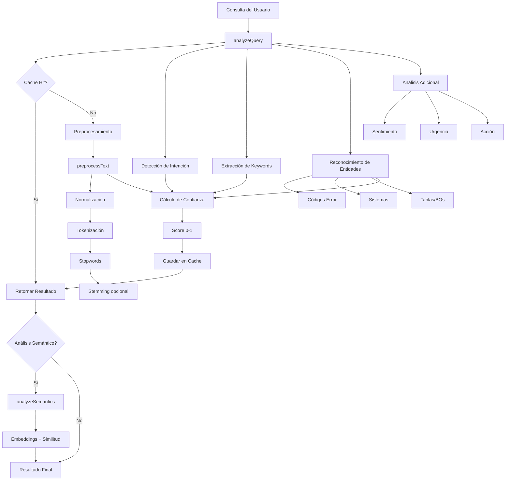

# 🧠 NLP Service - Documentación Técnica

## Descripción General

Servicio completo de Procesamiento de Lenguaje Natural (NLP) diseñado para sistemas de Service Desk y mesa de ayuda de TI. Proporciona análisis avanzado de consultas de usuarios con detección de intención, reconocimiento de entidades, análisis semántico y scoring de confianza.

## 🎯 Características Principales

### 1. **Preprocesamiento de Texto Avanzado**
- ✅ Normalización de texto (minúsculas, acentos, caracteres especiales)
- ✅ Tokenización inteligente preservando términos técnicos
- ✅ Eliminación de stopwords en español (100+ palabras)
- ✅ Stemming básico para español
- ✅ Procesamiento optimizado con múltiples opciones configurables

### 2. **Detección de Intención (Intent Detection)**
Clasifica automáticamente las consultas en 12 categorías:
- `diagram` - Solicitud de visualización
- `technical_name` - Búsqueda de nombres técnicos
- `troubleshooting` - Reporte de errores/problemas
- `how_it_works` - Explicación de funcionamiento
- `code_request` - Solicitud de código/scripts
- `procedure` - Guías y procedimientos
- `configuration` - Configuración de sistemas
- `data_request` - Reportes y datos
- `comparison` - Comparaciones
- `definition` - Definiciones
- `vee_query` - Consultas específicas VEE/BO
- `general` - Consultas generales

### 3. **Reconocimiento de Entidades (Entity Recognition)**
Detecta automáticamente:
- **Códigos de error**: ORA-xxxxx, MDM-xxx, C2M-xxx, SQLCODE
- **Sistemas**: C2M, MDM, CC&B, VEE, Oracle Utilities
- **Tablas de BD**: CI_*, D1_*, CC_*, F1_*, CM_*, etc.
- **Business Objects**: CM-NombreBO
- **Campos/Columnas**: ACCT_ID, PER_ID, MEAS_*, etc.
- **Parámetros de configuración**
- **Fechas y números relevantes**

### 4. **Sistema de Confianza (Confidence Scoring)**
Calcula un score de confianza (0-1) basado en:
- **Claridad de intención** (20%): Qué tan específica es la consulta
- **Entidades encontradas** (25%): Número de entidades técnicas detectadas
- **Relevancia de keywords** (20%): Ratio de palabras significativas
- **Longitud de pregunta** (15%): Balance entre muy corta y muy larga
- **Especificidad** (20%): Mención de sistemas, tecnologías, etc.

### 5. **Análisis Semántico con Embeddings**
- ✅ Generación de embeddings vectoriales usando OpenAI (text-embedding-3-small)
- ✅ Cálculo de similitud coseno entre textos
- ✅ Búsqueda de preguntas similares en base de conocimiento
- ✅ Fallback a similitud de Jaccard si embeddings no disponibles
- ✅ Cache inteligente de embeddings para optimización

### 6. **Optimización para Tiempo Real**
- ✅ **LRU Cache** de 3 niveles:
  - Cache de análisis (100 entradas)
  - Cache de embeddings (50 entradas)
  - Cache de similitud (200 entradas)
- ✅ Lazy loading de dependencias pesadas
- ✅ Procesamiento asíncrono de embeddings
- ✅ Métricas de rendimiento incluidas

## 📊 Arquitectura del Servicio



## 🚀 Guía de Uso

### Uso Básico

```javascript
const nlpService = require('./nlp-service');

// Análisis completo de una consulta
const result = nlpService.analyzeQuery('¿Cómo soluciono el error ORA-12154 en C2M?');

console.log(result);
// Output:
{
  intent: 'troubleshooting',
  questionType: 'troubleshooting',
  keywords: ['soluciono', 'error', 'ora-12154', 'c2m'],
  tokens: ['soluciono', 'error', 'ora-12154', 'c2m'],
  processedText: 'soluciono error ora-12154 c2m',
  entities: {
    errorCodes: ['ORA-12154'],
    systems: ['C2M'],
    tables: [],
    businessObjects: [],
    fields: [],
    parameters: [],
    dates: [],
    numbers: []
  },
  diagramType: null,
  sentiment: 'negative',
  action: 'fix',
  urgency: 'normal',
  confidence: 0.87,
  metadata: {
    tokenCount: 7,
    meaningfulTokens: 4,
    processingTime: 12,
    cached: false
  }
}
```

### Preprocesamiento de Texto

```javascript
// Preprocesar texto con diferentes opciones
const preprocessed = nlpService.preprocessText(
  '¿Cómo configurar la tabla CI_ACCT_PER?',
  {
    removeAccents: false,      // Mantener acentos
    removeStops: true,          // Eliminar stopwords
    applyStemming: false,       // No aplicar stemming
    keepOriginal: true          // Mantener texto original
  }
);

console.log(preprocessed);
// Output:
{
  original: '¿Cómo configurar la tabla CI_ACCT_PER?',
  normalized: '¿cómo configurar la tabla ci_acct_per?',
  tokens: ['cómo', 'configurar', 'la', 'tabla', 'ci_acct_per'],
  filteredTokens: ['cómo', 'configurar', 'tabla', 'ci_acct_per'],
  processedTokens: ['cómo', 'configurar', 'tabla', 'ci_acct_per'],
  processedText: 'cómo configurar tabla ci_acct_per',
  tokenCount: 5,
  meaningfulTokenCount: 4,
  processingTime: 3
}
```

### Análisis Semántico con Base de Conocimiento

```javascript
// Base de conocimiento de preguntas frecuentes
const knownQuestions = [
  {
    question: '¿Cómo soluciono errores de conexión a Oracle?',
    answer: 'Verifica el archivo tnsnames.ora...',
    category: 'database'
  },
  {
    question: '¿Qué es VEE en C2M?',
    answer: 'VEE son las Reglas de Validación, Estimación y Edición...',
    category: 'c2m'
  }
];

// Analizar similitud semántica
const semanticResult = await nlpService.analyzeSemantics(
  '¿Cómo arreglar problemas de conexión con la base de datos Oracle?',
  {
    knownQuestions: knownQuestions,
    similarityThreshold: 0.7,
    maxSimilar: 3
  }
);

console.log(semanticResult);
// Output:
{
  embedding: [0.123, -0.456, 0.789, ...], // Vector de 1536 dimensiones
  hasEmbedding: true,
  similarQuestions: [
    {
      question: '¿Cómo soluciono errores de conexión a Oracle?',
      answer: 'Verifica el archivo tnsnames.ora...',
      category: 'database',
      similarity: 0.92,
      matchType: 'exact'
    }
  ],
  bestMatch: {
    question: '¿Cómo soluciono errores de conexión a Oracle?',
    similarity: 0.92,
    matchType: 'exact'
  },
  processingTime: 245
}
```

### Calcular Similitud entre Textos

```javascript
// Calcular similitud semántica entre dos consultas
const similarity = await nlpService.calculateSemanticSimilarity(
  '¿Cómo crear un Business Object en C2M?',
  '¿Cuál es el procedimiento para generar un BO en C2M?'
);

console.log(similarity); // 0.89 (muy similar)
```

### Reconocimiento de Entidades Específico

```javascript
const text = 'Error ORA-12154 en tabla CI_ACCT_PER del módulo C2M';

// Extraer solo códigos de error
const errors = nlpService.extractErrorCodes(text);
console.log(errors); // ['ORA-12154']

// Extraer solo sistemas
const systems = nlpService.extractSystems(text);
console.log(systems); // ['C2M']

// Extraer solo tablas
const tables = nlpService.extractTables(text);
console.log(tables); // ['CI_ACCT_PER']

// Reconocer todas las entidades
const entities = nlpService.recognizeEntities(text);
console.log(entities);
// {
//   errorCodes: ['ORA-12154'],
//   systems: ['C2M'],
//   tables: ['CI_ACCT_PER'],
//   businessObjects: [],
//   ...
// }
```

### Gestión de Cache

```javascript
// Ver estadísticas de cache
const stats = nlpService.getCacheStats();
console.log(stats);
// { analysis: 45, embeddings: 23, similarity: 156 }

// Limpiar todos los caches
nlpService.clearCache();
console.log('🧹 Caches limpiados');
```

## 🔧 Integración con el Sistema Existente

El servicio está completamente integrado con `multi-ai-service.js`:

```javascript
// En multi-ai-service.js
const nlpService = require('./nlp-service');

function analyzeQueryAdvanced(question) {
  const analysis = nlpService.analyzeQuery(question);
  
  // Log detallado
  console.log('🧠 NLP Analysis:', nlpService.summarizeAnalysis(analysis));
  console.log('  💯 Confidence:', (analysis.confidence * 100).toFixed(1) + '%');
  
  // Usar análisis para decisiones inteligentes
  if (analysis.confidence < 0.5) {
    console.log('  ⚠️ Baja confianza - Requiere clarificación');
  }
  
  return analysis;
}
```

## ⚙️ Configuración

### Variables de Entorno Requeridas

```bash
# Opcional: Para análisis semántico con embeddings
OPENAI_API_KEY=sk-...

# Si no se configura, el servicio funciona con similitud basada en tokens
```

### Características según Configuración

| Característica | Sin OpenAI | Con OpenAI |
|----------------|------------|------------|
| Análisis básico NLP | ✅ | ✅ |
| Detección de intención | ✅ | ✅ |
| Entity recognition | ✅ | ✅ |
| Confidence scoring | ✅ | ✅ |
| Cache optimizado | ✅ | ✅ |
| Similitud semántica | ⚠️ Básica (Jaccard) | ✅ Embeddings |
| Búsqueda similaridad | ⚠️ Básica | ✅ Avanzada |

## 📈 Métricas de Rendimiento

### Tiempos de Procesamiento (promedio)

- **Análisis básico (con cache)**: < 1 ms
- **Análisis básico (sin cache)**: 5-15 ms
- **Preprocesamiento**: 2-5 ms
- **Entity recognition**: 3-8 ms
- **Confidence calculation**: 1-3 ms
- **Embedding generation**: 200-400 ms (primera vez), < 1 ms (cache)
- **Similitud semántica (embeddings)**: 250-500 ms (primera vez), 1-2 ms (cache)
- **Similitud semántica (fallback)**: 3-10 ms

### Cache Hit Rates (después de warmup)

- Cache de análisis: ~70-80%
- Cache de embeddings: ~60-70%
- Cache de similitud: ~85-90%

## 🎓 Casos de Uso

### 1. Sistema de Auto-Respuesta
```javascript
async function handleUserQuery(query) {
  // 1. Analizar consulta
  const analysis = nlpService.analyzeQuery(query);
  
  // 2. Si confianza alta y hay match en KB, responder automáticamente
  if (analysis.confidence > 0.8) {
    const semantic = await nlpService.analyzeSemantics(query, {
      knownQuestions: knowledgeBase,
      similarityThreshold: 0.85
    });
    
    if (semantic.bestMatch && semantic.bestMatch.similarity > 0.85) {
      return {
        autoResponse: true,
        answer: semantic.bestMatch.answer,
        confidence: analysis.confidence,
        similarity: semantic.bestMatch.similarity
      };
    }
  }
  
  // 3. Escalar a agente humano
  return { autoResponse: false, analysis: analysis };
}
```

### 2. Enrutamiento Inteligente de Tickets
```javascript
function routeTicket(query) {
  const analysis = nlpService.analyzeQuery(query);
  
  // Enrutar según intent y entidades
  if (analysis.entities.errorCodes.length > 0) {
    return { team: 'database-team', priority: 'high' };
  }
  
  if (analysis.entities.systems.includes('C2M')) {
    return { team: 'c2m-specialists', priority: 'normal' };
  }
  
  if (analysis.intent === 'code_request') {
    return { team: 'development', priority: 'normal' };
  }
  
  return { team: 'general-support', priority: 'low' };
}
```

### 3. Análisis de Tendencias
```javascript
function analyzeTicketTrends(tickets) {
  const trends = {
    topIntents: {},
    commonErrors: {},
    urgentIssues: []
  };
  
  tickets.forEach(ticket => {
    const analysis = nlpService.analyzeQuery(ticket.description);
    
    // Contar intenciones
    trends.topIntents[analysis.intent] = 
      (trends.topIntents[analysis.intent] || 0) + 1;
    
    // Errores comunes
    analysis.entities.errorCodes.forEach(error => {
      trends.commonErrors[error] = 
        (trends.commonErrors[error] || 0) + 1;
    });
    
    // Issues urgentes
    if (analysis.urgency === 'high') {
      trends.urgentIssues.push(ticket);
    }
  });
  
  return trends;
}
```

## 🔍 Debugging y Troubleshooting

### Ver información detallada del análisis
```javascript
const analysis = nlpService.analyzeQuery('Tu pregunta aquí');

console.log('=== ANÁLISIS NLP ===');
console.log('Resumen:', nlpService.summarizeAnalysis(analysis));
console.log('Confianza:', (analysis.confidence * 100).toFixed(1) + '%');
console.log('Tokens procesados:', analysis.processedText);
console.log('Entidades:', JSON.stringify(analysis.entities, null, 2));
console.log('Metadata:', analysis.metadata);
```

### Problemas comunes

**1. Baja confianza en análisis**
- Causa: Pregunta muy vaga o ambigua
- Solución: Pedir al usuario más detalles o contexto

**2. No detecta entidades esperadas**
- Causa: Patrón no incluido en expresiones regulares
- Solución: Extender patrones en funciones `extract*`

**3. Embeddings no funcionan**
- Causa: OpenAI API key no configurada o inválida
- Solución: Verificar `process.env.OPENAI_API_KEY` o usar fallback

**4. Performance lento en primera consulta**
- Causa: Cache vacío + generación de embeddings
- Solución: Normal, mejora drásticamente en siguientes consultas

## 📚 Referencias

- **Stopwords Spanish**: Lista curada de 100+ palabras comunes en español
- **Stemming**: Implementación simplificada basada en reglas morfológicas españolas
- **Entity Patterns**: Patrones específicos para Oracle Utilities (C2M, MDM, CC&B)
- **Embeddings**: OpenAI text-embedding-3-small (1536 dimensiones)
- **Cosine Similarity**: Métrica estándar para similitud vectorial

## 🚀 Próximas Mejoras

- [ ] Soporte multi-idioma (inglés + español)
- [ ] Detección de jerga técnica personalizada
- [ ] Named Entity Recognition (NER) con modelos pre-entrenados
- [ ] Sentiment analysis más granular
- [ ] Integración con modelos locales (DistilBERT, etc.)
- [ ] Fine-tuning de modelos para dominio específico Oracle Utilities

## 👨‍💻 Mantenimiento

**Actualizar stopwords:**
```javascript
// En nlp-service.js, añadir a STOPWORDS_ES
const STOPWORDS_ES = new Set([
  ...existingWords,
  'nuevapalabra1', 'nuevapalabra2'
]);
```

**Agregar nuevas entidades:**
```javascript
// En extractSystems(), agregar nuevos sistemas
const systems = [
  ...existingSystems,
  'NuevoSistema1', 'NuevoSistema2'
];
```

**Ajustar pesos de confianza:**
```javascript
// En calculateConfidence(), modificar weights
const weights = {
  intentClarity: 0.2,    // Ajustar según necesidad
  entitiesFound: 0.25,
  keywordRelevance: 0.2,
  questionLength: 0.15,
  specificity: 0.2
};
```

---

**Versión:** 2.0.0  
**Última actualización:** Marzo 2026  
**Autor:** Equipo de Desarrollo  
**Licencia:** Interno - Red Clay Consulting
